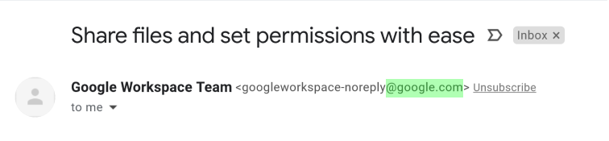

# Phising

Phishing is usually done through email, ads or by sites that look similar to sites that you already use.

For example, someone who is phishing might send you an email that looks like it's from Google so that you'll give them your Google login credentials.

Phishing emails or sites might ask for:

* Usernames and passwords, including password changes
* National Insurance numbers / Social Security Numbers
* Bank account numbers
* PINs \(Personal Identification Numbers\)
* Credit card numbers
* Your mother’s maiden name
* Your date of birth


Think you've leaked login or information? Please report it [here](https://link.conexresearch.com/breach).


## Phising Emails

Email is the most common method used for phising, here's a few tips to help spot a phising email.

1. Emails from

### Safe Sender List

These are domains used by our approved partners to send email, and makes it easier to spot phising attempts from fake senders.

The \[Ext\] will not be shown in the subject of emails from these senders, so if you recieve an email from one of these safe senders, and it has \[Ext\] in the subject, it's very likely to be a phising attempt.

_Please note, the amber 'External' marker may still be shown on legitimate emails, the \[Ext\] in the subject line is the best indicator._


Email [ops@conexresearch.com](mailto:ops@conexresearch.com) if you need help checking a sender.


| Sender | Email Domains |
| :--- | :--- |
| **Conex Research** | **conexresearch.com** |
| Cloudflare | cloudflare.com |
| Eventbrite | eventbrite.com |
| Google | google.com |
| Jotform | jotform.com |
| SendGrid | sendgrid.com |

### Example Phising Email

